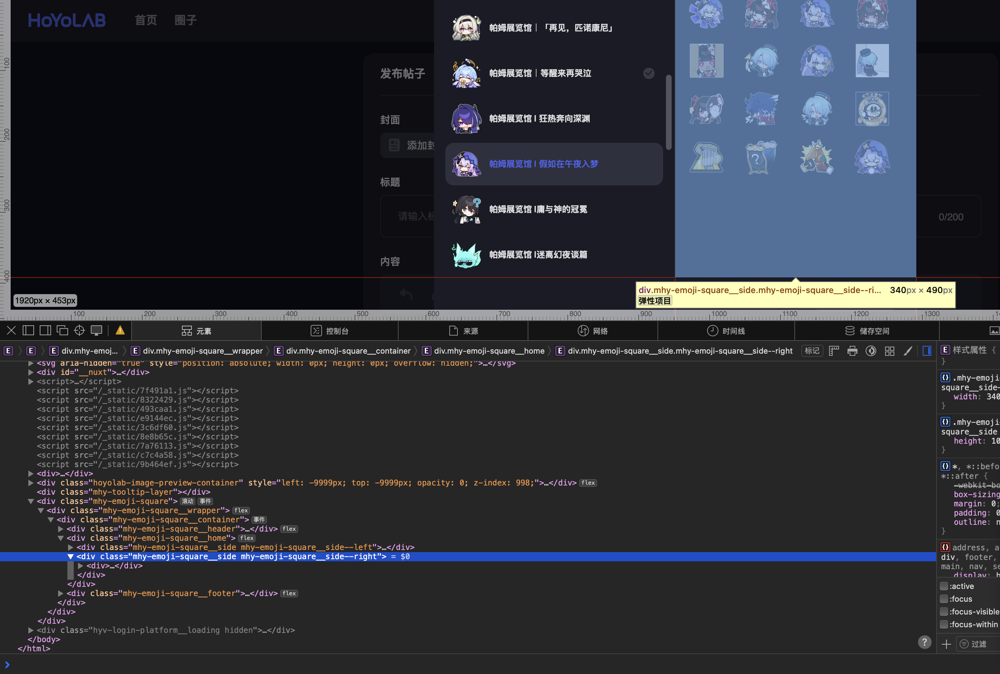

# HoYoLab 表情包收集
爬取和整理HoYoLab（米游社）上的表情包。（会尽快更新的）

## 目录
- [介绍](#介绍)
- [脚本使用](#脚本使用)
- [贡献](#贡献)
- [未命名文件](#未命名文件)

## 介绍
这里收集了 HoYoLab 上的表情包，HoYoLab 是国际版米游社，表情包从聊天界面抓取，HoYoLab 上表情包分辨率比米游社高。

原神的表情包只有`派蒙的画作（官方）`是官方的，其他是平台收录的同人表情包；星穹铁道和绝区零的都是官方的。原则上这些表情包仅限 HoYoLab 中使用，本仓库收录的表情包建议个人使用比如[生成贴纸](https://github.com/iBobbyTS/RandomLayoutSticker)，其他用途请遵守 HoYoLab 的相关规定。

目前包含以下游戏：
- 原神 (更新到 5.6)
- 崩坏：星穹铁道 (更新到 3.2)
- 绝区零 (更新到 1.2)

未包含游戏（欢迎玩家pull request到本仓库）：
- 崩坏学园2
- 崩坏3
- 未定事件簿

## 脚本使用
### `scrap.py`
用于抓取 HoYoLab 上的表情包，需要自己去 HoYoLab 上进入[发帖页面](https://www.hoyolab.com/newArticle/1)，然后点击表情包、+，然后开始检查元素，找到表情包的div。

复制整个div，粘贴到`scrap.py`的`sticker_grid`的html变量中，运行即可下载。

### `sort.py`
按照`character.json`的规则整理到`release`文件夹。

### `release.py`
用于将整理好的表情包打包成zip文件，方便下载。

## 贡献
欢迎给更新的表情包和尚未纳入的游戏提交 pull request。注意使用`scrap`脚本爬取后，自己将文件夹和表情包重命名，文件夹命名保留原本的序号，添加游戏的版本号和版本名（如`派蒙的画作第41弹` `->` `派蒙的画作（官方）/41-5.6 悖理`）。

表情包命名示例
- `角色名 - 当前文件夹里的序号`，如`妮露 - 1.png`
- 月桂是瑶瑶的，使用者如果想找瑶瑶的表情包，可能也需要月桂的，所以把单独月桂的表情包命名为`月桂 - （瑶瑶） - 1.png`，瑶瑶+月桂的表情包命名为`瑶瑶.png`即可（另还有锅巴、萨姆等）
- 包含多个角色的全都写上，如`妮可 - 安比.png`

## 未命名文件
有些角色不认识，还有些东西比较抽象，求个大佬帮忙命名。
```
绝区零/2024.6.25 Drip Fest/aec3d3a141014f694f528e71b1e092c6_5474911687596017974.png
绝区零/2024.6.25 Drip Fest/af92fe4fe5cc86e60e630dcba9c5cfd7_2069708535072993456.png
绝区零/2024.6.25 Drip Fest/fd64367bdb24b37f574d19915f050aba_1815080081349496467.png
绝区零/2024.6.25 Drip Fest/4291a31e632524721a82027e249900a6_3150220501018219332.png
绝区零/2024.6.25 Drip Fest/1961f3a797ed5d902cbfa3a0e39c2eb6_6694731625436582903.png
绝区零/2024.6.25 Drip Fest/88676963e045b214737d861d1c78e676_1674452690828452196.png
2022愚人节系列表情包/e58ce0b3f8663e1bcd6b9ee3c9aa2c56_2017792494863154359.gif
2022愚人节系列表情包/b9385a53b593c04d53caed4ba71cdf55_8705970719420136701.gif
2022愚人节系列表情包/0ac5dff15c0ac8b6d0d4d8c6c310ecc1_7011582623642354130.gif
崩坏：星穹铁道/帕姆展览馆（按版本）/2.2 等醒来再哭泣/a3d8d1b37472090172c1b682f50e4ed6_6744105025861654824.png
崩坏：星穹铁道/帕姆展览馆（按版本）/2.4 明霄竞武试锋芒/fe8d6dec192622beff242da6dd1154fa_9021052065824720626.png
原神/HoYoLab 非官方/「提瓦特新闻」系列表情包/4cb8def8a608083044c3b9e76f8e6289_3797313058364198657.png
原神/HoYoLab 非官方/「提瓦特新闻」系列表情包/81e96a4c2d7c6f9d8abe0d8cfd38d484_1570056176368386502.png
原神/派蒙的画作（官方）/19-3.2/6f0ac2f49034b2e921cdc9c6c77f7a85_6516064932807854321.png
```
